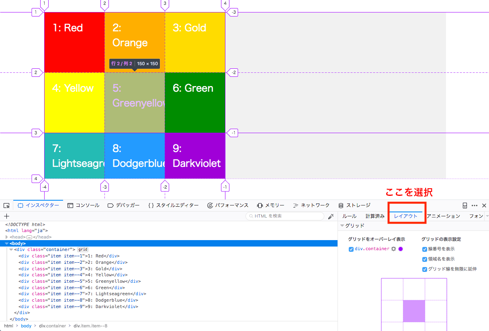
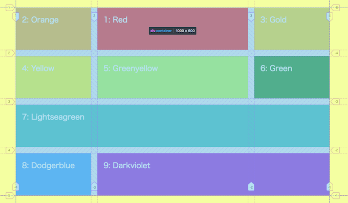
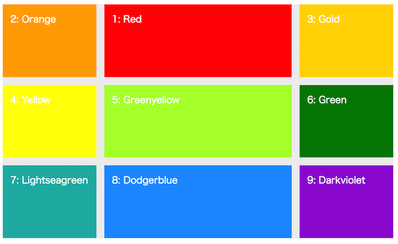
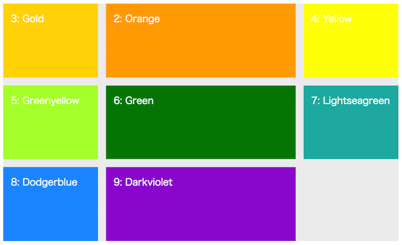
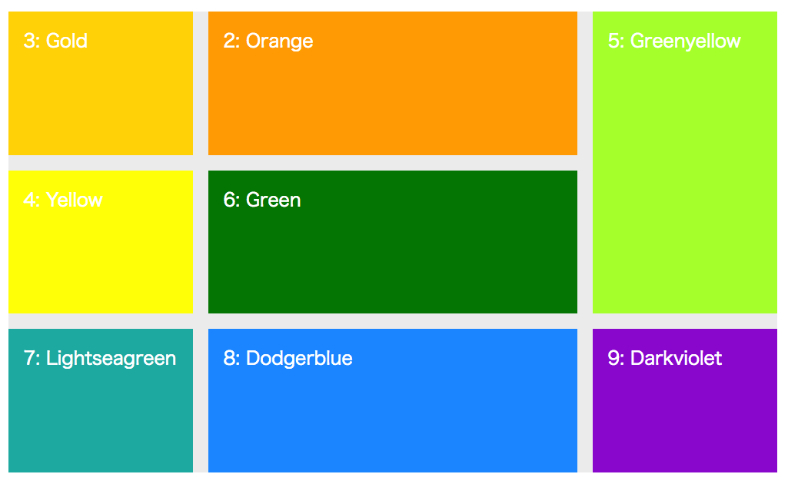

# CSS Grid layout
[CSS Grid Layout Module Level 1](https://www.w3.org/TR/2017/CR-css-grid-1-20171214/)

下の図は典型的なflex-layout  


次の図はgrid-layout  


[使用可能なブラウザ](https://caniuse.com/#feat=css-grid)

開発ブラウザはFirefoxがお薦め


## グリッドレイアウトコーディングの基本
グリッドレイアウトを行うにはまず次の名前を覚えましょう。

1. グリッドコンテナ：個々のグリッドを囲むコンテナ
2. グリッドアイテム：コンテナ内の各子要素
3. グリッドトラック：個別のグリッド
4. グリッドライン：グリッドトラックの境界線で自動で番号が付けられる。
5. ガター：隣接するグリッドの間隔



### グリッド作成手順(branch:no1)

コンテナに`display:grid`を設定することでグリッドレイアウトを作成することができます。
次にグリッドのサイズを決めていきます。

1. グリッドコンテナに「display:grid」プロパティを記述します。
2. グリッドコンテナに行方向を表す「grid-template-rows」プロパティで値は半角スペースで区切りながらサイズを決めていきます。
3. グリッドコンテナに列方向を表す「grid-template-columns」プロパティで値は半角スペースで区切りながらサイズを決めていきます。
4. 行間や列間はマージンを入れるのではなく、グリッドコンテナにに「grid-gap」プロパティを使います。
5. グリッドアイテムに特に設定がなければグリッドアイテムのソースの順番にグリッドコンテナで決めた場所に格納されていきます。

### 同じグリッドを複数作成(branch:no2)
上のように同じサイズのグリッドを複数作成する場合は、repeat()を使うことができます。
繰り返しでない値を入れる場合は、半角スペースで区切って続ければOKです。

```
grid-template-rows: repeat(3,150px);
grid-template-columns: repeat(2,150px) 300px;
```

### fr単位について(branch:no2)
グリッドコンテナにグリッドを作成してまだ隙間がある場合にそれを埋めてくれる単位が「fr」です。  
frはfractionのこと

```
grid-template-rows: repeat(3,1fr);
grid-template-columns: repeat(3,1fr);
```

* max-contentとmin-contentの使い方も覚えておきましょう。  
max-contentはcontentに依存した大きさになり、最大のcontentのサイズに従います。min-contentは最小のcontentのサイズになります。

### グリッドアイテムの配置(branch:no3)
グリッドアイテムはソースの順番にグリッドコンテナのグリッドに配置されます。
その配置を変更したい場合はgrid-rowプロパティとgrid-columnプロパティを使い、次のようにします。

「grid-row-start」と「grid-row-end」のショートハンドが「grid-row」の記述です。

```
.item--1{
	background-color:red;
	/*grid-row-start:2;
	grid-row-end:3;*/
	grid-row:2/3;
	grid-column:2/3;
}
```

#### grid-area(branch:no4)
「grid-row」と「grid-column」をさらにまとめたのが、「grid-area」プロパティです。
次の例は1行3列から2行4列までという意味になります。

```
grid-area:1 / 3 / 2 / 4
```

### 複数行に渡るグリッドの作成(branch:no5)
例えば「.item--1」は現在2行目の2列目に配置されています。  
これを2行目の2列目から3列目にかけて配置したい場合は次のようにします。

```
.item--1{
	background-color:red;
	grid-row:2/3;
	grid-column:2/4;
}
```

これと同様な結果となりますが、spanを使うこともできます。


```
.item--1{
	background-color:red;
	grid-row:2/3;
	grid-column:2/span 2;
}
```

さらに、-1を指定するとそれは最後までを意味します。

```
.item--1{
	background-color:red;
	grid-row:2/3;
	grid-column:1/-1;
}
```


これで複数のグリッドをまたいで配置できましたが、もともとそこに配置されていたグリッドアイテムは一つ先のグリッドに配置されます。そして溢れ出した最後のグリッドアイテムは、自動的に作成された行や列に収まることになります。このようにしてできたグリッドを暗黙的なグリッド（implicit grid）と言います。

**暗黙的なグリッドの調整が必要な場合は`grid-auto-rows`や`grid-auto-columns`プロパティまたは`grid-auto-flow`プロパティを使います。**

複数のグリッド配置では面白い配置ができます。それは、同じ場所にグリッドアイテムをおくことです。

ここからは一旦グリッドアイテムの配置はソースの記述順に戻してから以下のようにしました。
つまり、「.item--1」と「.item--2」に同じ位置のグリッドを指定します。
そしてこのように重ねた場合は「z-index」で重ね順を変えることができます。

```
.item--1{
	background-color:red;
	grid-row:1/2;
	grid-column:2/3;
}
.item--2{
	background-color:orange;
	grid-row:1/2;
	grid-column:2/3;	
}
```

結果は次のようになります。  
item--1だけ変更したレイアウト



同じ位置を指定したレイアウト



この方法を使うとレイアウトの幅は大きく広がります。

例えば以下のようなレイアウトは今までは、レイアウトのために無駄なdivの入れ子を作るなどする必要があり、簡単にできなかったものです。

```
.item--5{
	background-color:greenyellow;
	grid-area:1/3/3/4;
}
```



### グリッドラインに名前をつける(branch:no6)
グリッドラインは自動で引かれますが、その時に番号が振られます。
その番号を使用して設定を行うことができますが、番号の代わりに名前をつけることもできます。その場合は命名するときは[]の中に名前を入れます。名前を使うときはそのまま名前を使います。

```
.container{
	display: grid;
	grid-template-rows:[row1-start] 1fr [row1-end row2-start] 1fr [row2-end row3-start] 1fr [row3-end row4-start]1fr[row4-end];
	grid-gap:20px;
}
.item--1{
	grid-row:row1-start/row1-end;
}
```

また、リピートする場合は次のようにします。

```
grid-template-rows:repeat(4,[row-start]1fr[row-end]);
```

### グリッドエリアに名前をつける(branch:no7)
「grid-template-areas」プロパティを使うとグリッドエリアに名前をつけることができます。
この方法でグリッドを作成すると比較的直感的に作成できるかもしれません。

ポイントは「grid-template-areas」プロパティの設定です。  
1行分の名前を""でくくることがポイントです。  
もし、グリッドを割り与えたくない場所には「.」で表現します。

```
grid-template-areas:
"item--1 item--1 item--4 item--4" 
"item--2 item--3 item--4 item--4"
"item--5 item--6 item--7 item--7"
"item--8 . item--9 item--9";
}
```

各グリッドアイテムへの紐付けは以下のようにします。

```
.item--1{
	grid-area: item--1;
}
.item--2{
	grid-area: item--2;
}
```

### align-itemsとjustify-itemsの活用(branch:no8)
gridレイアウトでも「align-items」と「justify-items」が使えます。

デフォルトでは「align-items: stretch;」がグリッドコンテナにかかっています。  
この値を「center」などに変更すると確認することができます。

また、「align-self」や「justify-self」プロパティも使用が可能です。


